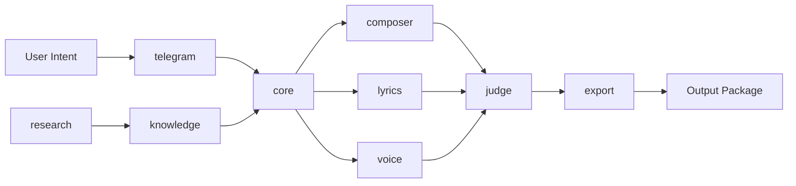

# ARCHITECTURE

## System Overview

AI Music Factory is a modular pipeline platform where each stage of music creation is represented by an isolated module. `core/` coordinates flow, while specialized modules own focused responsibilities.

Primary objective in this stage is structural clarity, not runtime logic.

## Folder Structure

- `.ai/`: internal AI assistant metadata and future automation state
- `docs/`: architecture and technical documents
- `core/`: orchestration and shared runtime contracts (future)
- `research/`: experiments, notes, and prototyping records
- `knowledge/`: prompts, templates, references, and reusable creative intelligence
- `composer/`: composition generation module (future)
- `lyrics/`: lyric generation and refinement module (future)
- `voice/`: vocal style and voice production module (future)
- `judge/`: evaluation, scoring, and policy checks module (future)
- `telegram/`: user interaction and bot entrypoint module (future)
- `export/`: packaging and output delivery module (future)
- `scripts/`: operational scripts for environment, backup, and git flow
- `tests/`: unit, integration, and scenario testing (future)
- `assets/`: static files and non-code media assets
- `config/`: environment, module, and deployment configuration

## Module Relationship

## Data Flow

1. User request enters through `telegram/`.
2. `core/` creates a run context and orchestrates stages.
3. Creative modules (`composer/`, `lyrics/`, `voice/`) produce artifacts.
4. `judge/` validates quality, style, and policy constraints.
5. Approved outputs are passed to `export/` for packaging.
6. Final artifacts are returned via delivery channels.

## Knowledge Flow

1. Insights from `research/` become codified prompts/rules in `knowledge/`.
2. `core/` and module components consume `knowledge/` assets.
3. Evaluation outcomes from `judge/` feed back into knowledge updates.
4. Continuous improvement is managed without tightly coupling knowledge to runtime code.

## Future AI Factory Ecosystem

AI Music Factory is designed to interoperate with sibling factories in a broader ecosystem.

- Shared standards for run metadata and artifacts
- Reusable governance patterns and script conventions
- Possible shared `Shared_Knowledge` synchronization strategy
- Cross-factory evaluation and orchestration compatibility
